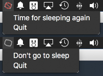

# electron-block-screensaver-example

**Wanna read something and don't want to be interrupted?**

**Have got a terminal session open and just want to watch it?**

This is an example project to show how to use the `Tray` module and prevent your machine to go into screensaver or sleep mode.

`electron-block-screensaver` will put itself inside of your menu bar and give you an easy way to not interupts you by going into sleep or screensave mode.

